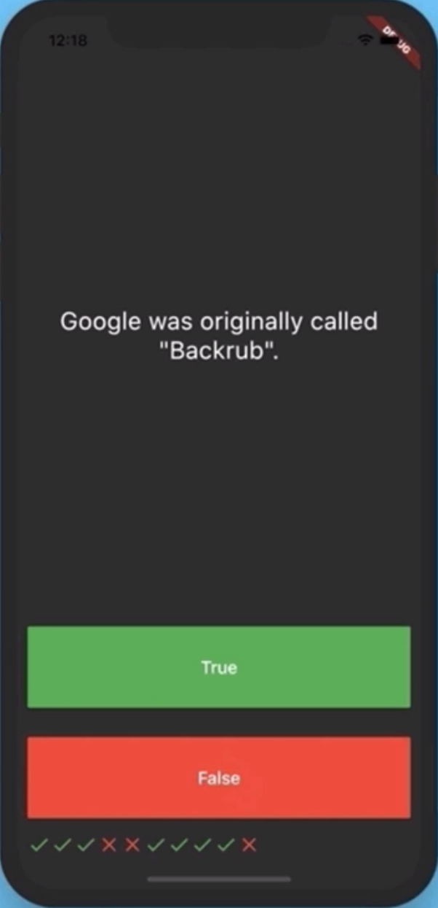
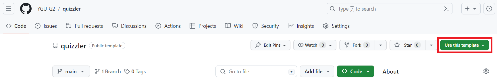
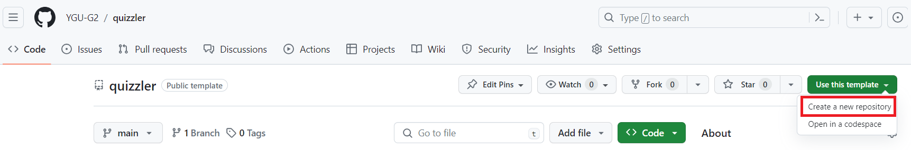
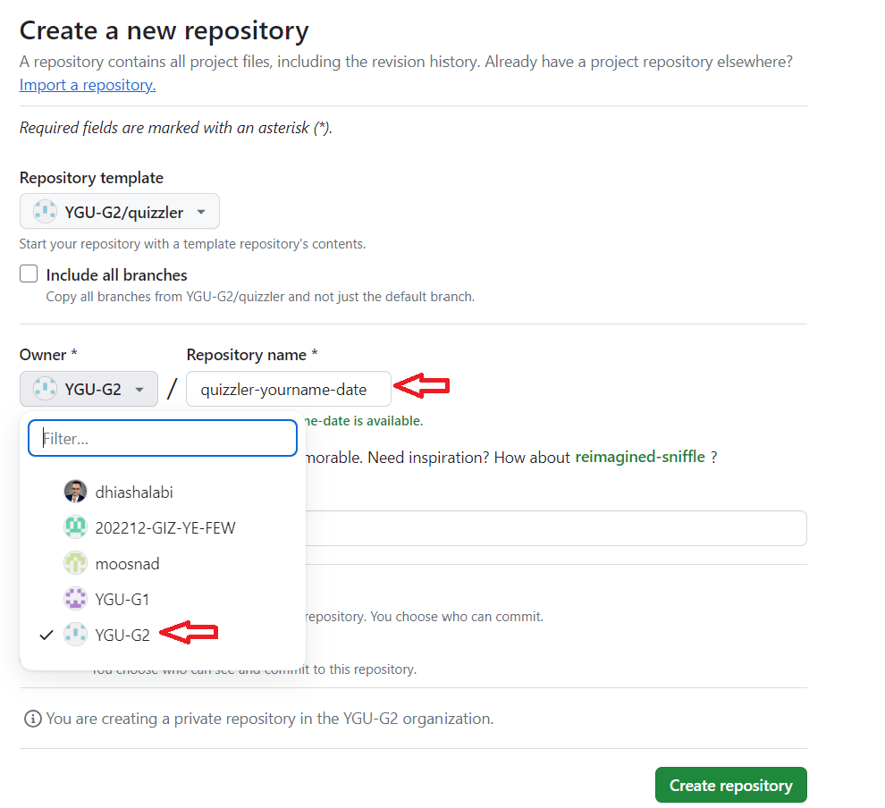
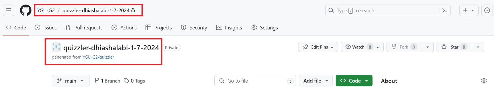
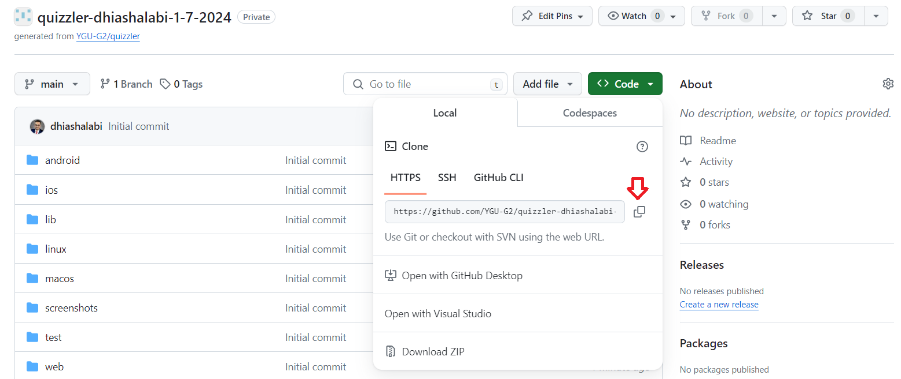

# Quizzler Flutter App

A simple quiz app made with Flutter and Dart to illustrate the use of OOP concepts in Dart.

## Learning Goals

- How to use Dart lists.
- How to loop through code blocks.
- How to use Dart maps.
- How to use the `Expanded` widget to make widgets adapt to screen dimensions.
- How to use `setState` to mark the widget tree as dirty and requiring update on the next render.
- How to use `final` and `const` keywords.
- How to use `Icon` widgets.
- How to use `Text` widgets.
- How to use `class` and `object` in Dart.

## Introduction

This app is a simple quiz app that asks the user a series of questions and displays the result at the end of the quiz.
In addition to the questions, the app also displays a score counter at the top or bottom of the screen to keep track of the user's score.

## Screenshots

## Getting Started
Clone this repository and open it in your IDE. Run the app on your emulator or device, and then push the source code to your own GitHub repository in this organization.

## How to Complete the Lab
- Use this repository template to create a new repository in the `YGU-G2` organization.

**Repository name:** `quizzler-yourusername-date`
e.g. `quizzler-johndoe-1-7-2024`
or `quizzler-janedoe-2024-1-7`
- Clone the repository to your local machine.

- Open the project in your IDE.
- Complete the app according to the specifications below.
- Commit your code frequently and push to GitHub.
- Assign your instructor as a collaborator on GitHub when you are done or when you need help.

### Deliverables
- **Complete the app.** The app should display the questions and answers, and keep track of the user's score.
- **Commit your code to GitHub frequently.** Aim for at least one commit every 30 minutes.
- **Push your code to GitHub when you are done, before the deadline.** You can push multiple times, but you must push your code at least once before the deadline.

## Conclusion
In this lab, you learned how to use Dart lists, loops, and maps to create a simple quiz app. You also learned how to use the `Expanded` widget to make widgets adapt to screen dimensions, and how to use `setState` to mark the widget tree as dirty and requiring update on the next render. Finally, you learned how to use `final` and `const` keywords, and how to use `Icon` and `Text` widgets.